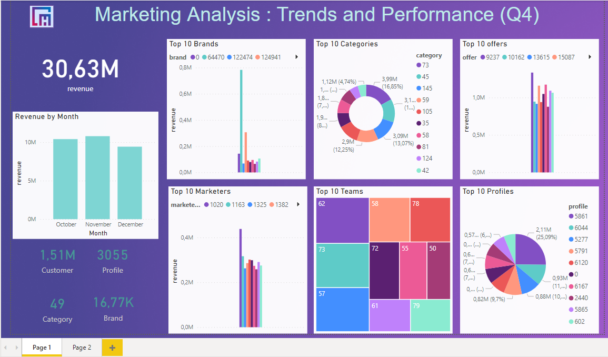
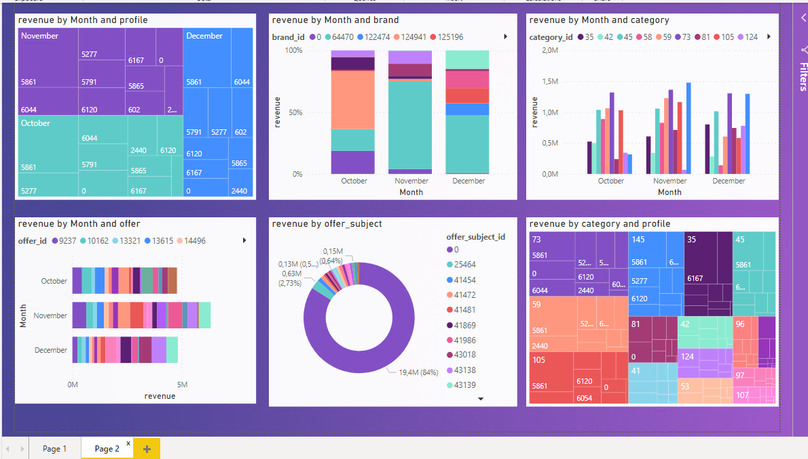

# Projet d'Analyse Marketing avec Power BI

Ce projet a pour objectif d'effectuer une analyse marketing approfondie en utilisant Power BI pour visualiser les tendances et les performances au cours du quatrième trimestre (Q4). Les données utilisées pour cette analyse comprennent un ensemble de 1 million de points de données.

## Aperçu

L'analyse se concentre sur les domaines clés suivants :

- **Tendances de Marketing** : Identification des tendances du marché au Q4.
- **Performance des Campagnes** : Évaluation des performances des campagnes marketing.
- **Analyse des Segments de Clients** : Compréhension du comportement des différents segments de clients.
  

